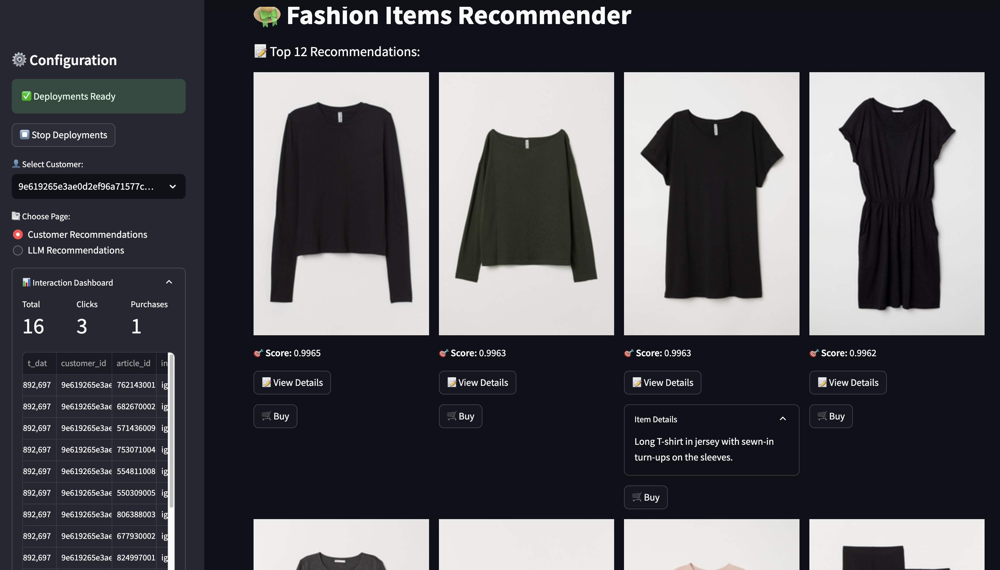

<table style="border-collapse: collapse; border: none;">
  <tr style="border: none;">
    <td width="20%" style="border: none;">
      <a href="https://decodingml.substack.com/" aria-label="Decoding ML">
        
      </a>
    </td>
    <td width="80%" style="border: none;">
      <div>
        <h2>📬 Stay Updated</h2>
        <p><b><a href="https://decodingml.substack.com/">Join Decoding ML</a></b> for proven content on designing, coding, and deploying production-grade AI systems with software engineering and MLOps best practices to help you ship AI applications. Every week, straight to your inbox.</p>
      </div>
    </td>
  </tr>
</table>

<p align="center">
  <a href="https://decodingml.substack.com/">
    
  </a>
</p>

------

# 🚀 Installation and Usage Guide

This guide will help you set up and run a machine learning pipeline that includes feature engineering, model training, and deployment using Hopsworks and OpenAI.

# 📑 Table of Contents

- [📋 Prerequisites](#-prerequisites)
- [🎯 Getting Started](#-getting-started)
- [⚡️ Running the H&M Personalized Recommender](#️-running-the-hm-personalized-recommender)
- [🤖 Running the ML Pipelines in GitHub Actions](#-running-the-ml-pipelines-in-github-actions)
- [🌐 Live Demo](#-live-demo)
- [☁️ Deploying the Streamlit App](#️-deploying-the-streamlit-app)

# 📋 Prerequisites

## Local Tools
You'll need the following tools installed locally:

| Tool | Version | Purpose | Installation Link |
|------|---------|---------|------------------|
| Python | 3.11 | Programming language runtime | [Download](https://www.python.org/downloads/) |
| uv | ≥ 0.4.30 | Python package installer and virtual environment manager | [Download](https://github.com/astral-sh/uv) |
| GNU Make | ≥ 3.81 | Build automation tool | [Download](https://www.gnu.org/software/make/) |
| Git | ≥2.44.0 | Version control | [Download](https://git-scm.com/downloads)

## Cloud Services
The project requires access to these cloud services:

| Service | Purpose | Cost | Required Credentials | Setup Guide |
|---------|---------|------|---------------------|-------------|
| [Hopsworks](https://rebrand.ly/serverless-github) | AI Lakehouse for feature store, model registry, and serving | Free tier available | `HOPSWORKS_API_KEY` | [Create API Key](https://docs.hopsworks.ai/latest/user_guides/projects/api_key/create_api_key/) |
| [GitHub Actions](https://github.com/features/actions) | Compute & Automation | Free for public repos | - | - |
| [OpenAI API](https://openai.com/index/openai-api/) | LLM API for recommender system | Pay-per-use | `OPENAI_API_KEY` | [Quick Start Guide](https://platform.openai.com/docs/quickstart) |

# 🎯 Getting Started

## 1. Clone the Repository

Start by cloning the repository and navigating to the project directory:
```
git clone https://github.com/decodingml/personalized-recommender-course.git
cd personalized-recommender-course 
```

Next, we have to prepare your Python environment and its adjacent dependencies.

## 2. Installation

Set up the project environment by running the following:
```bash
make install
```
Test that you have Python 3.11.8 installed in your new `uv` environment:
```bash
uv run python --version
# Output: Python 3.11.8
```

This command will:
- Create a virtual environment using `uv`
- Activate the virtual environment
- Install all dependencies from `pyproject.toml`

> [!NOTE]
> Normally, `uv` will pick the right Python version mentioned in `.python-version` and install it automatically if it is not on your system. If you are having any issues, explicitly install the right Python version by running `make install-python`

## 3. Environment Configuration

Before running any components:
1. Create your environment file:
   ```bash
   cp .env.example .env
   ```
2. Open `.env` and configure the required credentials following the inline comments and the recommendations from the [Cloud Services](#-prerequisites) section.

# ⚡️ Running the H&M Personalized Recommender

## Notebooks

For instructions on exploring the Notebooks, check out the [📚 Course](https://github.com/decodingml/personalized-recommender-course?tab=readme-ov-file#-course-outline) section from the main [README](https://github.com/decodingml/personalized-recommender-course?tab=readme-ov-file#-course-outline).

## Running the ML Pipelines

You can run the entire pipeline at once or execute individual components.

### Running Everything in One Go (Quick)

Execute all the ML pipelines in a sequence:
```bash
make all
```
It will take ~1.5 hours to run, depending on your machine. 

This runs the following steps:
1. Feature engineering
2. Retrieval model training
3. Ranking model training
4. Candidate embeddings creation
5. Inference pipeline deployment
6. Materialization job scheduling

View results in [Hopsworks Serverless](https://rebrand.ly/serverless-github): **Data Science → Deployments**

Start the Streamlit UI:
```bash
make start-ui
```
Accessible at `http://localhost:8501/`

### Running Individual Components (Recommended)

Each component can be run separately:

1. **Feature Engineering**
```bash
make feature-engineering
```
It will take ~1 hour to run, depending on your machine. 

View results in [Hopsworks Serverless](https://rebrand.ly/serverless-github): **Feature Store → Feature Groups**

2. **Retrieval Model Training**
```bash
make train-retrieval
```
View results in [Hopsworks Serverless](https://rebrand.ly/serverless-github): **Data Science → Model Registry**

3. **Ranking Model Training**
```bash
make train-ranking
```
View results in [Hopsworks Serverless](https://rebrand.ly/serverless-github): **Data Science → Model Registry**

4. **Embeddings Creation**
```bash
make create-embeddings
```
View results in [Hopsworks Serverless](https://rebrand.ly/serverless-github): **Feature Store → Feature Groups**

5. **Deployment Creation**
```bash
make create-deployments
```
View results in [Hopsworks Serverless](https://rebrand.ly/serverless-github): **Data Science → Deployments**

<p align="center">
  <a href="https://rebrand.ly/serverless-github">
    
  </a>
</p>

Start the Streamlit UI:
```bash
make start-ui
```
Accessible at `http://localhost:8501/`

> [!IMPORTANT]
> The demo is in 0-cost mode, which means that when there is no traffic, the deployment scales to 0 instances. The first time you interact with it, give it 1-2 minutes to warm up to 1+ instances. Afterward, everything will become smoother.

6. **Materialization Job Scheduling**
```bash
make schedule-materialization-jobs
```
View results in [Hopsworks Serverless](https://rebrand.ly/serverless-github): **Compute → Ingestions**

7. **Deployment Creation with LLM Ranking (Optional)**

Optional step to replace the standard deployments (created in Step 5) with the ones powered by LLMs:
```bash
make create-deployments-llm-ranking
```
**NOTE**: If the script fails, go to [Hopsworks Serverless](https://rebrand.ly/serverless-github): **Data Science → Deployments**, forcefully stop all the deployments and run again.

> [!WARNING]
> The LLM Ranking deployment overrides the deployment from **5. Deployment Creation**

Start the Streamlit UI that interfaces the LLM deployment:
```bash
make start-ui-llm-ranking
```
Accessible at `http://localhost:8501/`

> [!WARNING]
> The Streamlit UI command is compatible only with its corresponding deployment. For example, running the deployment from **5. Deployment Creation** and `make start-ui-llm-ranking` won't work.

## Clean Up Resources

Remove all created resources from [Hopsworks Serverless](https://rebrand.ly/serverless-github):
```bash
make clean-hopsworks-resources
```

### 🚨 Important Notes
- Ensure UV is properly installed and configured before running any commands
- All notebooks are executed using IPython through the UV virtual environment
- Components should be run in the specified order when executing individually

# 🤖 Running the ML Pipelines in GitHub Actions

This project supports running ML pipelines automatically through GitHub Actions, providing an alternative to local or Colab execution.

> [!NOTE]
> This is handy when getting network errors, such as timeouts, on your local machine. GitHub Actions has an enterprise-level network that will run your ML pipelines smoothly.

## Pipeline Triggers

The ML pipelines can be triggered in three ways:
- Manual trigger through GitHub UI
- Scheduled execution (configurable)
- On push to main branch (configurable)

## Setup Process

### 1. Fork Repository
Create your own copy of the repository to access GitHub Actions:
```bash
# Use GitHub's UI to fork the repository
https://github.com/original-repo/name → Your-Username/name
```
[📚 GitHub Fork Guide](https://docs.github.com/en/pull-requests/collaborating-with-pull-requests/working-with-forks/fork-a-repo)

### 2. Configure Secrets
Set up required environment variables as GitHub Actions secrets:

**Option A: Using GitHub UI**
1. Navigate to: Repository → Settings → Secrets and variables → Actions
2. Click "New repository secret"
3. Add required secrets:
   - `HOPSWORKS_API_KEY`
   - `OPENAI_API_KEY`

[📚 Set up GitHub Actions Secrets Guide](https://docs.github.com/en/actions/security-for-github-actions/security-guides/using-secrets-in-github-actions?tool=webui)

<p align="center">
  <a href="https://decodingml.substack.com/p/33d3273e-b8e3-4d98-b160-c3d239343022">
    
  </a>
</p>

**Option B: Using GitHub CLI**

If you have `GitHub CLI` installed, instead of settings the GitHub Actions secrets manually, you can set them by running the following:

```bash
gh secret set HOPSWORKS_API_KEY
gh secret set OPENAI_API_KEY
```

### 3. Execute Pipeline

#### Manual Execution
1. Go to Actions → ML Pipelines
2. Click "Run workflow"
3. Select branch (default: main)
4. Click "Run workflow"

<p align="center">
  <a href="https://decodingml.substack.com/p/33d3273e-b8e3-4d98-b160-c3d239343022">
    
  </a>
</p>

After triggering the pipeline, you will see it running, signaled by a yellow circle. Click on it to see the progress.

<p align="center">
  <a href="https://decodingml.substack.com/p/33d3273e-b8e3-4d98-b160-c3d239343022">
    
  </a>
</p>

After it is finished, it should look like this:

<p align="center">
  <a href="https://decodingml.substack.com/p/33d3273e-b8e3-4d98-b160-c3d239343022">
    
  </a>
</p>

#### Automated Execution

Another option is to run the ML pipelines automatically on a schedule or when new commits are pushed to the main branch.

Edit `.github/workflows/ml_pipelines.yaml` to enable automatic triggers:

```yaml
name: ML Pipelines

on:
  # schedule: # Uncomment to run the pipelines every 2 hours. All the pipelines take ~1.5 hours to run.
  #   - cron: '0 */2 * * *'
  # push: # Uncomment to run pipelines on every new commit to main
  #   branches:
  #     - main
  workflow_dispatch:  # Allows manual triggering from GitHub UI
```

## Monitoring & Results

1. **Pipeline Progress**
   - View real-time execution in Actions tab
   - Each step shows detailed logs and status

2. **Output Verification**
   - Access results in [Hopsworks Serverless](https://rebrand.ly/serverless-github)
   - Check Feature Groups, Feature Views, Model Registry, and Deployments

## ⚠️ Important Notes
- Full pipeline execution takes approximately 1.5 hours
- Ensure sufficient GitHub Actions minutes available
- Monitor usage when enabling automated triggers

# 🌐 Live Demo

Try out our deployed H&M real-time personalized recommender to see what you'll learn to build by the end of this course:
[💻 Live H&M Recommender Streamlit Demo](https://decodingml-hands-on-personalized-recommender.streamlit.app/)

> [!IMPORTANT]
> The demo is in 0-cost mode, which means that when there is no traffic, the deployment scales to 0 instances. The first time you interact with it, give it 1-2 minutes to warm up to 1+ instances. Afterward, everything will become smoother.

<p align="center">
  <a href="https://decodingml.substack.com/p/33d3273e-b8e3-4d98-b160-c3d239343022">
    
  </a>
</p>

# ☁️ Deploying the Streamlit App

Deploying a Streamlit App to their [cloud](https://streamlit.io/cloud) is free and straightforward after the GitHub repository is set in right place:

- `uv.lock` - installing Python dependencies
- `packages.txt` - installing system dependencies
- `streamlit_app.py` - entrypoint to the Streamlit application

## Deployment Steps

### 1. Repository Setup
Fork the repository if you haven't already:
```bash
# Use GitHub's UI to fork the repository
https://github.com/original-repo/name → Your-Username/name
```
[📚 GitHub Fork Guide](https://docs.github.com/en/pull-requests/collaborating-with-pull-requests/working-with-forks/fork-a-repo)

### 2. Streamlit Cloud Setup
1. Create a free account on [Streamlit Cloud](https://docs.streamlit.io/deploy/streamlit-community-cloud/get-started)
2. Navigate to [New App Deployment](https://docs.streamlit.io/deploy/streamlit-community-cloud/deploy-your-app)
3. Configure deployment settings:

| Setting | Configuration | Description |
|---------|--------------|-------------|
| App Type |  | Select "Deploy a public app from GitHub" |
| Main Settings |  | Configure your repository |
| Advanced Settings |  | Set Python 3.11 and `HOPSWORKS_API_KEY` |

## ⚠️ Important Notes
- Ensure all required files are present in your repository
- Python version must be set to 3.11
- `HOPSWORKS_API_KEY` must be configured in environment variables
- Repository must be public for free tier deployment

[📚 More on Streamlit Cloud deployments](https://docs.streamlit.io/deploy)
