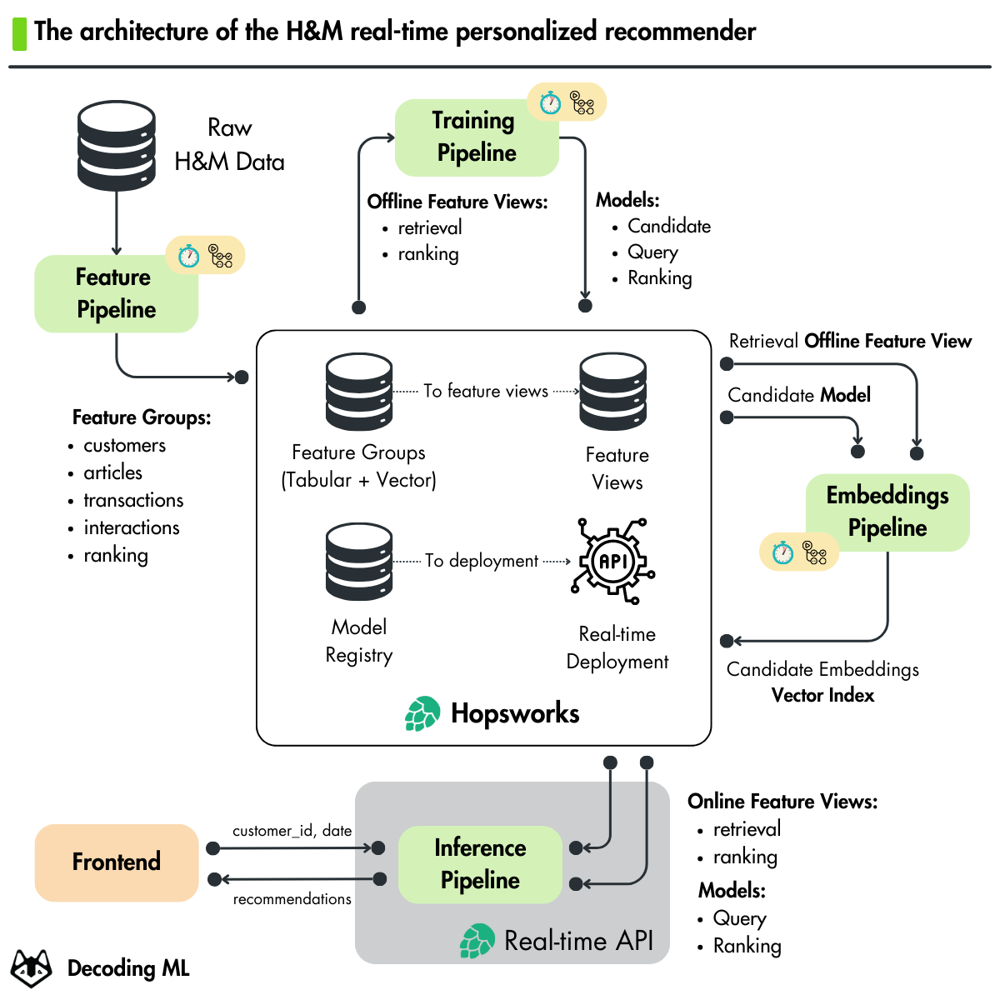
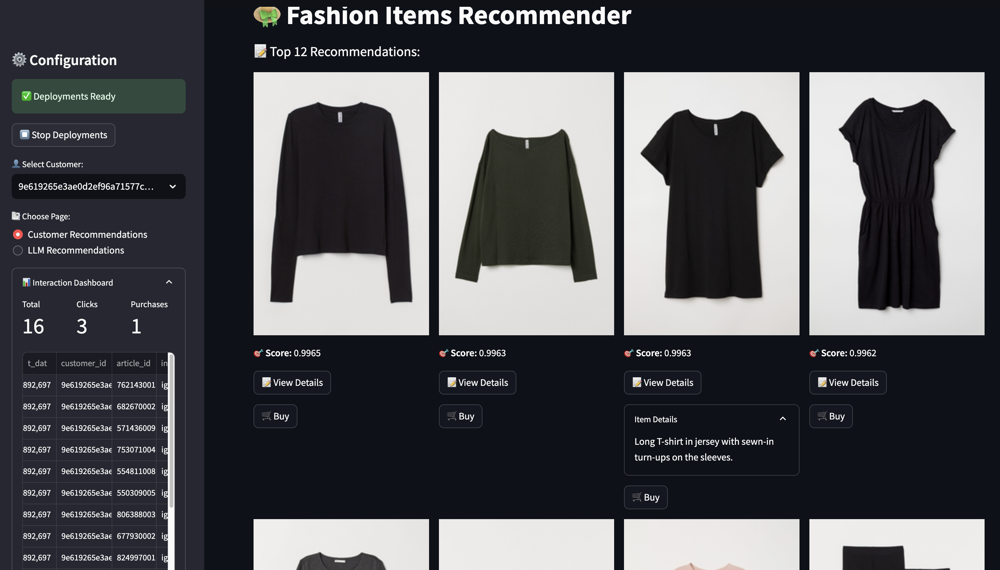

<div align="center">
  <h1>Hands-on H&M Real-Time Personalized Recommender</h1>
  <p class="tagline">Open-source course by <a href="https://decodingml.substack.com">Decoding ML</a> in collaboration with <a href="https://rebrand.ly/homepage-github">Hopsworks</a>.</p>
</div>

</br>

<p align="center">
  <a href="https://decodingml.substack.com/p/33d3273e-b8e3-4d98-b160-c3d239343022">
    
  </a>
</p>

## 🎯 What You'll Learn

This hands-on course teaches you how to build and deploy a real-time personalized recommender system for H&M fashion articles. You'll learn:

- To architect a modern ML system for real-time personalized recommenders.
- To do feature engineering using modern tools such as Polars.
- To design and train ML models for recommender systems powered by neural networks.
- To use MLOps best practices by leveraging [Hopsworks AI Lakehouse](https://rebrand.ly/homepage-github).
- To deploy the recommender on a Kubernetes cluster managed by [Hopsworks Serverless](https://rebrand.ly/serverless-github) using KServe.
- To apply LLM techniques for personalized recommendations.

<p align="center">
  
  
</p>

## 📖 About This Course

This course is part of Decoding ML's open-source series, where we provide free hands-on resources for building GenAI and recommender systems.

The **Hands-on H&M Real-Time Personalized Recommender**, in collaboration with [Hopsworks](https://rebrand.ly/homepage-github), is a 5-module course backed up by code, Notebooks and lessons that will teach you how to build an H&M real-time personalized recommender from scratch.

By the end of this course, you will know how to architect, build and deploy a modern recommender.

**What you'll do:**

1. Architect a scalable and modular ML system using the Feature/Training/Inference (FTI) architecture.
3. Feature engineering on top of our H&M data for collaborative and content-based filtering techniques for recommenders.
2. Use the two-tower network to Create user and item embeddings in the same vector space.
3. Implement an H&M real-time personalized recommender using the 4-stage recommender design and a vector database.
4. Use MLOps best practices, such as a feature store and a model registry.
5. Deploy the online inference pipeline to Kubernetes using KServe.
6. Deploy the offline ML pipelines to GitHub Actions.
7. Implement a web interface using Streamlit.
8. Improve the H&M real-time personalized recommender using LLMs.

🥷 With these skills, you'll become a ninja in building real-time personalized recommenders. 

## 🌐 Live Demo

Try out our deployed H&M real-time personalized recommender to see what you'll learn to build by the end of this course:
[💻 Live H&M Recommender Streamlit Demo](https://decodingml-hands-on-personalized-recommender.streamlit.app/)

> [!IMPORTANT]
> The demo is in 0-cost mode, which means that when there is no traffic, the deployment scales to 0 instances. The first time you interact with it, give it 1-2 minutes to warm up to 1+ instances. Afterward, everything will become smoother.

<p align="center">
  <a href="https://decodingml.substack.com/p/33d3273e-b8e3-4d98-b160-c3d239343022">
    
  </a>
</p>

----

<table style="border-collapse: collapse; border: none;">
  <tr style="border: none;">
    <td width="20%" style="border: none;">
      <a href="https://decodingml.substack.com/" aria-label="Decoding ML">
        
      </a>
    </td>
    <td width="80%" style="border: none;">
      <div>
        <h2>📬 Stay Updated</h2>
        <p><b><a href="https://decodingml.substack.com/">Join Decoding ML</a></b> for proven content on designing, coding, and deploying production-grade AI systems with software engineering and MLOps best practices to help you ship AI applications. Every week, straight to your inbox.</p>
      </div>
    </td>
  </tr>
</table>

<p align="center">
  <a href="https://decodingml.substack.com/">
    
  </a>
</p>

## 👥 Who Should Join?

**This course is ideal for:**
- ML/AI engineers interested in building production-ready recommender systems
- Data Engineers, Data Scientists, and Software Engineers wanting to understand the engineering behind recommenders

**Note:** This course focuses on engineering practices and end-to-end system implementation rather than theoretical model optimization or research.

## 🎓 Prerequisites

| Category | Requirements |
|----------|-------------|
| **Skills** | Basic understanding of Python and Machine Learning |
| **Hardware** | Any modern laptop/workstation will do the job (no GPU or powerful computing power required). We also support Google Colab or GitHub Actions for compute.|
| **Level** | Intermediate |


## 💰 Cost Structure

All tools used throughout the course will stick to their free tier, except OpenAI's API, as follows:

- Modules 1-4: Completely free
- Module 5 (Optional): ~$1-2 for OpenAI API usage when building LLM-enhanced recommenders

## 🥂 Open-source Course: Participation is Open and Free

As an open-source course, you don't have to enroll. Everything is self-paced, free of charge and with its resources freely accessible as follows:
- **code**: this GitHub repository
- **articles**: [Decoding ML](https://decodingml.substack.com/p/the-ultimate-recommender-system-framework)

## 📚 Course Outline

This **open-source course consists of 5 comprehensive modules** covering theory, system design, and hands-on implementation.

Our recommendation for each module:
1. Read the article
2. Run the Notebook to replicate our results (locally or on Colab)
3. Following the Notebook, go deeper into the code by reading the `recsys` Python module

> [!NOTE]
> Check the [INSTALL_AND_USAGE](https://github.com/decodingml/hands-on-personalized-recommender/blob/main/INSTALL_AND_USAGE.md) doc for a step-by-step installation and usage guide.

| Module | Article | Description | Notebooks |
|--------|-------|-------------|----------------|
| 1 | [Building a TikTok-like recommender](https://decodingml.substack.com/p/33d3273e-b8e3-4d98-b160-c3d239343022) | Learn how to architect a recommender system using the 4-stage architecture and two-tower network. | **No code** |
| 2 | [Feature pipelines for TikTok-like recommenders](https://decodingml.substack.com/p/feature-pipeline-for-tiktok-like) | Learn how to build a scalable feature pipeline using a feature store. | •[1_fp_computing_features.ipynb](notebooks/1_fp_computing_features.ipynb) |
| 3 | [Training pipelines for TikTok-like recommenders](https://decodingml.substack.com/p/training-pipelines-for-tiktok-like) | Learn to train and evaluate the two-tower network and ranking model using MLOps best practices. | •[2_tp_training_retrieval_model.ipynb](notebooks/2_tp_training_retrieval_model.ipynb)<br>•[3_tp_training_ranking_model.ipynb](notebooks/3_tp_training_ranking_model.ipynb) |
| 4 | [Deploy scalable TikTok-like recommenders](https://decodingml.substack.com/p/deploy-scalable-tiktok-like-recommenders) | Learn how to architect and deploy the inference pipelines for real-time recommendations using the 4-stage design. | •[4_ip_computing_item_embeddings.ipynb](notebooks/4_ip_computing_item_embeddings.ipynb)<br>•[5_ip_creating_deployments.ipynb](notebooks/5_ip_creating_deployments.ipynb)<br>•[6_scheduling_materialization_jobs.ipynb](notebooks/6_scheduling_materialization_jobs.ipynb) |
| 5 | [Using LLMs to build TikTok-like recommenders](https://decodingml.substack.com/p/using-llms-to-build-tiktok-like-recommenders) | Learn how to enhance the H&M personalized recommender with LLMs. | •[7_ip_creating_deployments_llm_ranking.ipynb](notebooks/7_ip_creating_deployments_llm_ranking.ipynb) |

### Google Colab

To run the Notebooks in Google Colab, copy-paste them into your Google Drive, open them with Google Colab, and run them as running them locally. At the beginning of each Notebook, we have a set of setup steps that will **prepare the code and Python environment automatically**.

----

<table style="border-collapse: collapse; border: none;">
  <tr style="border: none;">
    <td width="20%" style="border: none;">
      <a href="https://decodingml.substack.com/" aria-label="Decoding ML">
        
      </a>
    </td>
    <td width="80%" style="border: none;">
      <div>
        <h2>📬 Stay Updated</h2>
        <p><b><a href="https://decodingml.substack.com/">Join Decoding ML</a></b> for proven content on designing, coding, and deploying production-grade AI systems with software engineering and MLOps best practices to help you ship AI applications. Every week, straight to your inbox.</p>
      </div>
    </td>
  </tr>
</table>

<p align="center">
  <a href="https://decodingml.substack.com/">
    
  </a>
</p>

## 🏗️ Project Structure

At Decoding ML we teach how to build production ML systems, thus the course follows the structure of a real-world Python project:

```bash
.
├── notebooks/          # Jupyter notebooks for each pipeline
├── recsys/             # Core recommender system package
│   ├── config.py       # Configuration and settings
│   ...
│   └── training/       # Training pipelines code
├── tools/              # Utility scripts
├── streamlit_app.py    # Streamlit app entry point
├── .env.example        # Example environment variables template
├── Makefile            # Commands to install and run the project
├── pyproject.toml      # Project dependencies
```

## 👔 Dataset

We will use the [H&M Personalized Fashion Recommendations](https://www.kaggle.com/competitions/h-and-m-personalized-fashion-recommendations) dataset, available on Kaggle, open-source for academic research and education.

It is an e-commerce dataset that contains fashion articles from the H&M clothes brand.

It contains:
- 105k articles
- 137k customers
- 31 million transactions 

More on the dataset in the feature engineering pipeline [Notebook](notebooks/1_fp_computing_features.ipynb) and [article](https://decodingml.substack.com/p/feature-pipeline-for-tiktok-like).

## 🚀 Getting Started

For detailed installation and usage instructions, see our [INSTALL_AND_USAGE](https://github.com/decodingml/hands-on-personalized-recommender/blob/main/INSTALL_AND_USAGE.md) guide.

**Recommendation:** While you can follow the installation guide directly, we strongly recommend reading the accompanying articles to gain a complete understanding of the recommender system.

## 💡 Questions and Troubleshooting

Have questions or running into issues? We're here to help!

Open a [GitHub issue](https://github.com/decodingml/hands-on-personalized-recommender/issues) for:
- Questions about the course material
- Technical troubleshooting
- Clarification on concepts

When having issues with [Hopsworks Serverless](https://rebrand.ly/serverless-github), the best place to ask questions is on [Hopsworks's Slack](https://join.slack.com/t/public-hopsworks/shared_invite/zt-1uf21vitz-rhHKNdIf8GEiOf1EJ6Wzsw), where their engineers can help you directly.

## 🥂 Contributing

As an open-source course, we may not be able to fix all the bugs that arise.

If you find any bugs and know how to fix them, support future readers by contributing to this course with your bug fix.

We will deeply appreciate your support for the AI community and future readers 🤗

## Sponsors

<table>
  <tr>
    <td align="center">
      <a href="https://rebrand.ly/homepage-github" target="_blank">Hopsworks</a>
    </td>
  </tr>
  <tr>
    <td align="center">
      <a href="https://rebrand.ly/homepage-github" target="_blank">
        
      </a>
    </td>
  </tr>
</table>

## Contributors

<table>
  <tr>
    <td align="center">
      <a href="https://github.com/iusztinpaul">
        <br />
        <sub><b>Paul Iusztin</b></sub>
      </a><br />
      <sub>AI/ML Engineer</sub>
    </td>
    <td align="center">
      <a href="https://github.com/915-Muscalagiu-AncaIoana">
        <br />
        <sub><b>Anca Ioana Muscalagiu</b></sub>
      </a><br />
      <sub>AI/ML Engineer</sub>
    </td>
     <td align="center">
      <a href="https://github.com/paoloap-py">
        <br />
        <sub><b>Paolo Perrone</b></sub>
      </a><br />
      <sub>AI/ML Engineer</sub>
    </td>
    <td align="center">
      <a href="https://github.com/logicalclocks">
        <br />
        <sub><b>Hopsworks's Engineering Team</b></sub>
      </a><br />
      <sub>AI Lakehouse</sub>
    </td>
  </tr>
</table>


## License

This course is an open-source project released under the MIT license. Thus, as long you distribute our LICENSE and acknowledge your project is based on our work, you can safely clone or fork this project and use it as a source of inspiration for your educational projects (e.g., university, college degree, personal projects, etc.).

----

<table style="border-collapse: collapse; border: none;">
  <tr style="border: none;">
    <td width="20%" style="border: none;">
      <a href="https://decodingml.substack.com/" aria-label="Decoding ML">
        
      </a>
    </td>
    <td width="80%" style="border: none;">
      <div>
        <h2>📬 Stay Updated</h2>
        <p><b><a href="https://decodingml.substack.com/">Join Decoding ML</a></b> for proven content on designing, coding, and deploying production-grade AI systems with software engineering and MLOps best practices to help you ship AI applications. Every week, straight to your inbox.</p>
      </div>
    </td>
  </tr>
</table>

<p align="center">
  <a href="https://decodingml.substack.com/">
    
  </a>
</p>
